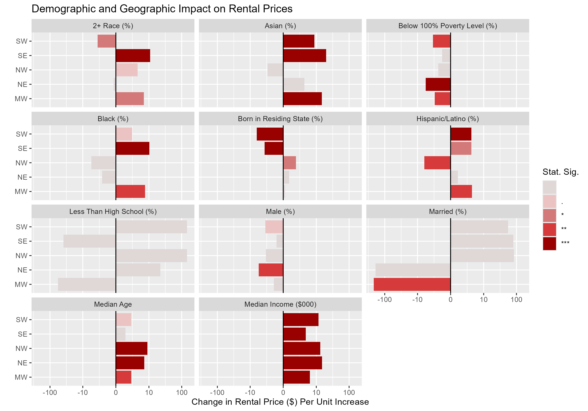

# What Drives Rent: A Deep Dive Into People, Place, and Price

This analysis investigates how demographic and socioeconomic factors influence one-bedroom rental prices across five U.S. regions: Northeast, Northwest, Southeast, Southwest, and Midwest. Using ZIP Code–level data merged from ACS, HUD FMR, and HUD-USPS crosswalk files, region-specific linear regression models with robust standard errors were applied to identify significant predictors of rent variation. The goal is to quantify localized effects of variables such as race, income, education, and marital status on rental housing costs.

---

## Description of Data Source

Data sources from three publicly available sources were used in this analysis to investigate how demographic and socioeconomic factors relate to rental prices.

1. The geographic and demographic data are derived from the American Community Survey (ACS) conducted by the U.S. Census Bureau. The 2023 ACS S0601 dataset used in this analysis contains variables including median income, educational attainment, racial composition, and housing characteristics.

2. Rent data is derived from the 2023 Fair Market Rent (FMR) published annually by the U.S. Department of Housing and Urban Development (HUD), which contains rent estimates calculated using a combination of the ACS, HUD, and Consumer Price Index data.

3. Residential vacancy indicators are derived from ZIP-Track Crosswalk files produced by HUD in collaboration with the U.S. Postal Service. The 2023 Q2 file used filters out ZIP Codes with low residential ratios or primarily commercial/industrial land use, allowing the analysis to focus on deriving meaningful insights from relevant areas.

To ensure balanced sampling across geographic regions, the dataset was stratified into five regions (Midwest, Northeast, Southeast, Southwest, and Northwest), and 1,000 ZIP Codes were randomly selected per region, resulting in a final dataset of 5,000 rows and 37 columns. This consolidated dataframe serves as the basis for all models and visualizations below.

---

## Linear Regression Models

To examine how demographic and socioeconomic factors relate to rent prices across the United States, five separate linear regressions were conducted—one for each region: Northeast (NE), Northwest (NW), Southeast (SE), Southwest (SW), and Midwest (MW). Each model used the SAFMR 1BR variable (Small Area Fair Market Rent for one-bedroom units) as the dependent variable, with demographic indicators such as race, marital status, educational attainment, income, and language use as predictors.

The tables display the full regression results with robust standard errors (HC1) to address potential heteroskedasticity. In the following sections, most notable results from each region are summarized, focusing on statistically significant coefficients (p < 0.05), the direction and magnitude of associations, and any unique patterns that emerge across geographies. 

---

### Regression Results for the Northeastern Region

In the Northeast, higher percentages of Black residents and Hispanic/Latino populations are associated with significantly lower rent prices, with coefficients of -80.33 and -67.40 respectively (both p < 0.01). Conversely, a higher percentage of Asian residents is associated with higher rents (+67.64, p < 0.05). Median income also shows a strong positive correlation to rent (+0.13 per $1,000, p < 0.01). Educational attainment, marital status, and other demographic variables showed no significant associations in this region.

---

### Regression Results for the Northwestern Region

In the Northwest, rents rise significantly with Median Age (+11.99, p < 0.01) and Median Income (+0.07 per $1,000, p < 0.01). Black (%) and Hispanic/Latino (%) show significant negative associations with rent (-77.70 and -72.97 respectively, p < 0.01). Interestingly, Percent Married has a large positive effect on rent (+74.51, p < 0.01), suggesting a link between household structure and rental prices in the NW region.

---

### Regression Results for the Southeastern Region

In the Southeast, Percent Asian residents have a positive and significant association with rent prices (+84.75, p < 0.01). In contrast, Percent Hispanic/Latino and Percent with Less than High School education are both linked to lower rents (-59.58 and -61.97 respectively, p < 0.01). Percent Married again shows a strong positive link to higher rents (+71.86, p < 0.01), consistent with patterns observed in the Northwest.

---

### Regression Results for the Southwestern Region

The Southwest model shows strong negative associations between rent and both Percent Hispanic/Latino (-75.64, p < 0.01) and Percent Less Than High School (-73.78, p < 0.01). Median Income remains a significant positive predictor (+0.11 per $1,000, p < 0.01). Like in the NW and SE, Percent Married has a positive and statistically significant effect on rent (+68.36, p < 0.01).

---

### Regression Results for the Midwest Region

In the Midwest, Black (%) is associated with significantly lower rents (-62.41, p < 0.01), as is Percent Less Than High School (-65.66, p < 0.01). The positive association between Median Income and rent persists here (+0.12 per $1,000, p < 0.01). Unique to this region, Percent Native Hawaiian or Pacific Islander has a significant positive coefficient (+318.45, p < 0.01), though the sample size for this group may be small.

---

## Demographic and Geographic Impact on Rental Prices

The graph illustrates the estimated change in rental prices associated with one-unit increases in various demographic and socioeconomic indicators, based on region-specific linear regression models. Each bar represents a coefficient from the model, color-coded by statistical significance (from p < 0.1 being lightest to p < 0.001 being darkest), and measured in dollars per unit increase in the variable.

Across all five regions, median income is the most consistently impactful variable, showing a strong and statistically significant positive association with rent prices. A $1,000 increase in median income within a ZIP Code is associated with a $60 to $120 increase in the SAFMR 1-bedroom rent estimate. 

Overall, the graph highlights that while income is a strong universal predictor of rent, the influence of race, education, and marital structure varies meaningfully by region. The presence of consistent negative rent associations for Black and Hispanic/Latino populations underscores persistent structural disparities, even after controlling for income and other demographic variables. Meanwhile, positive associations with educational attainment and marriage suggest that perceived indicators of socioeconomic status are embedded in how rent is priced at the neighborhood level.

---

## Files

- `demographic-impacts-on-rent.pdf`: Rendered PDF version of the report
- `demographic-impacts-on-rent.Rmd`: R Markdown file for data wrangling, modeling, and visualization  
- `demographic-impacts-on-rent-full-report.pdf`: PDF version of the full report with additional co-writer analysis
- `demographic-impacts-on-rent-full-report.qmd`: Quarto Markdown of the full report with additional co-writer analysis
- `data/`: Folder containing raw public data from ACS, FRM, and HUD
- `tables-graphs/`: Folder containing all regression tables and a visual comparison

---

## Tools

- R, RStudio  
- Packages: `ggplot2`, `dplyr`, `tidyverse`, `stargazer`, `sandwich`, `lmtest`, `scales`, `rmarkdown`

---

## Citation

U.S. Census Bureau, “S0601 Selected Characteristics of the Total and Native Populations in the United States”, <<https://data.census.gov/table?q=s0601>>, accessed on March 25, 2025.

HUD User’s Office of Policy Development and Research, “Fair Market Rents”, <www.huduser.gov/portal/datasets/fmr.html>, accessed on March 25, 2025.

HUD User’s Office of Policy Development and Research, “HUD-USPS ZIP Crosswalk Files” <www.huduser.gov/apps/public/uspscrosswalk/home>, accessed on March 25, 2025.
